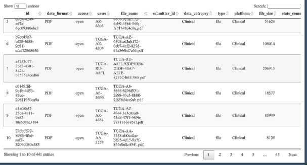

# A gentle way to get TCGA data with R.

### Preparation

Firstly, you need a R package named [TCGAbiolinks](http://bioconductor.org/packages/release/bioc/html/TCGAbiolinks.html)
.

To install this package, start R (version "4.0") and enter:

```r
if (!requireNamespace("BiocManager", quietly = TRUE))
  install.packages("BiocManager")

BiocManager::install("TCGAbiolinks")
```

After installation, you might meet problems when loading the package, which needs you to reload the `lifecycle` package
manually in advance.

```r
library("lifecycle")
library("TCGAbiolinks")
```

### Data Acquisition

##### Different sources

In GDC database the clinical data can be retrieved from different sources:

* indexed clinical: a refined clinical data that is created using the XML files.
* XML files: original source of the data
* BCR Biotab: tsv files parsed from XML files

There are two main differences between the indexed clinical and XML files:

* XML has more information: radiation, drugs information, follow-ups, biospecimen, etc. So the indexed one is only a
  subset of the XML files
* The indexed data contains the updated data with the follow up information. For example: if the patient is alive in the
  first time clinical data was collect and the in the next follow-up he is dead, the indexed data will show dead. The
  XML will have two fields, one for the first time saying he is alive (in the clinical part) and the follow-up saying he
  is dead.

Other useful clinical information available are:

* Tissue slide image
* Pathology report - Slide image

In this example we will fetch clinical data from BCR Biotab files.

```r
query <- GDCquery(project = "TCGA-COAD",
                  data.category = "Clinical",
                  data.type = "Clinical Supplement",
                  data.format = "BCR Biotab")
# --------------------------------------
# o GDCquery: Searching in GDC database
# --------------------------------------
# Genome of reference: hg38
# --------------------------------------------
# oo Accessing GDC. This might take a while...
# --------------------------------------------
# ooo Project: TCGA-COAD
# --------------------
# oo Filtering results
# --------------------
# ooo By data.format
# ----------------
# oo Checking data
# ----------------
# ooo Check if there are duplicated cases
# Warning: There are more than one file for the same case. Please verify query results. You can use the command View(getResults(query)) in rstudio
# ooo Check if there results for the query
# -------------------
# o Preparing output
# -------------------

GDCdownload(query)
# Downloading data for project TCGA-COAD
# GDCdownload will download 7 files. A total of 948.792 KB
# Downloading as: Fri_Mar_26_16_01_01_2021.tar.gz
# Downloading: 110 kB
```

Then, we can get all files that meet our screening criteria.

Moreover, files can be seen on Rstudio.

```r
library(dplyr)

query %>%
  getResults %>%
  DT::datatable(options = list(scrollX = TRUE, keys = TRUE)
  )
```



We next try to download slide images as another example.

```r
query <- GDCquery(project = "TCGA-COAD",
                  data.category = "Biospecimen",
                  data.type = "Slide Image",
                  barcode = c("TCGA-AA-3489"))
# --------------------------------------
# o GDCquery: Searching in GDC database
# --------------------------------------
# Genome of reference: hg38
# --------------------------------------------
# oo Accessing GDC. This might take a while...
# --------------------------------------------
# ooo Project: TCGA-COAD
# --------------------
# oo Filtering results
# --------------------
# ooo By data.type
# ooo By barcode
# ----------------
# oo Checking data
# ----------------
# ooo Check if there are duplicated cases
# Warning: There are more than one file for the same case. Please verify query results. You can use the command View(getResults(query)) in rstudio
# ooo Check if there results for the query
# -------------------
# o Preparing output
# -------------------

GDCdownload(query)
```

*P.S. The `.svs` file is quite big!*