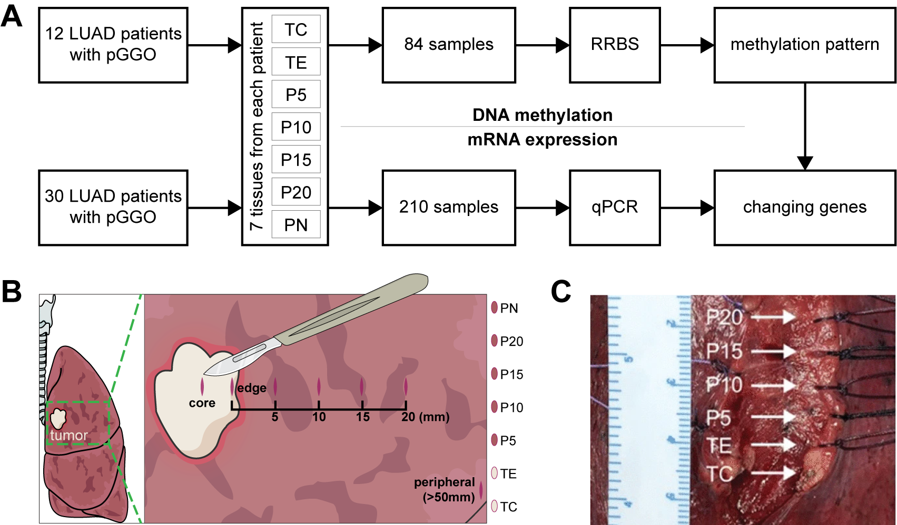
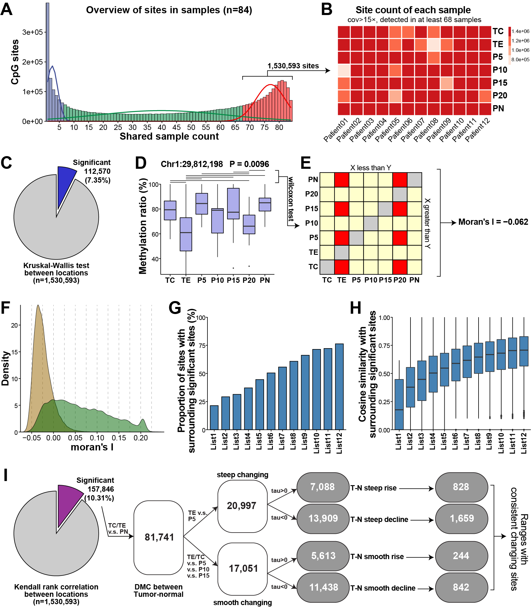
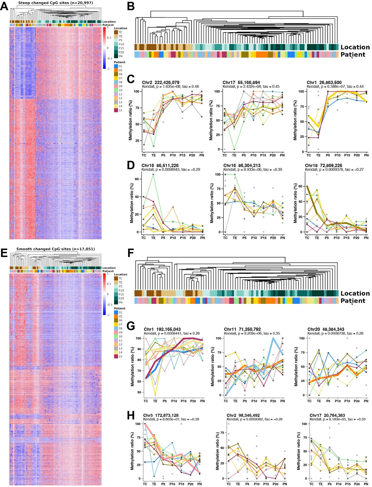
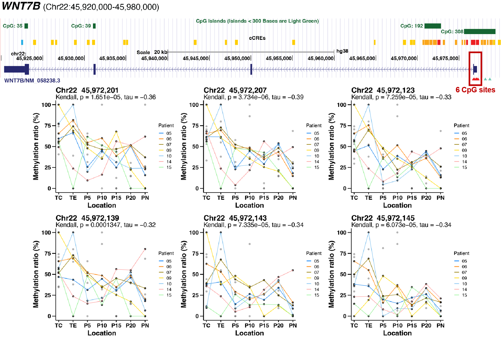
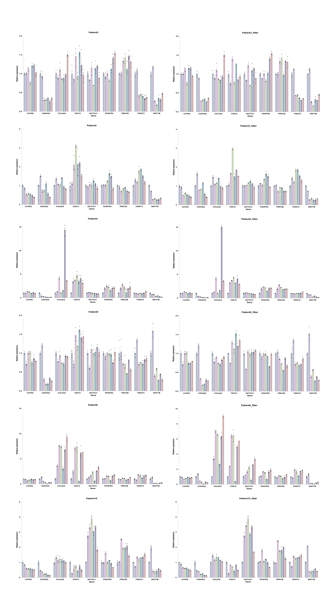
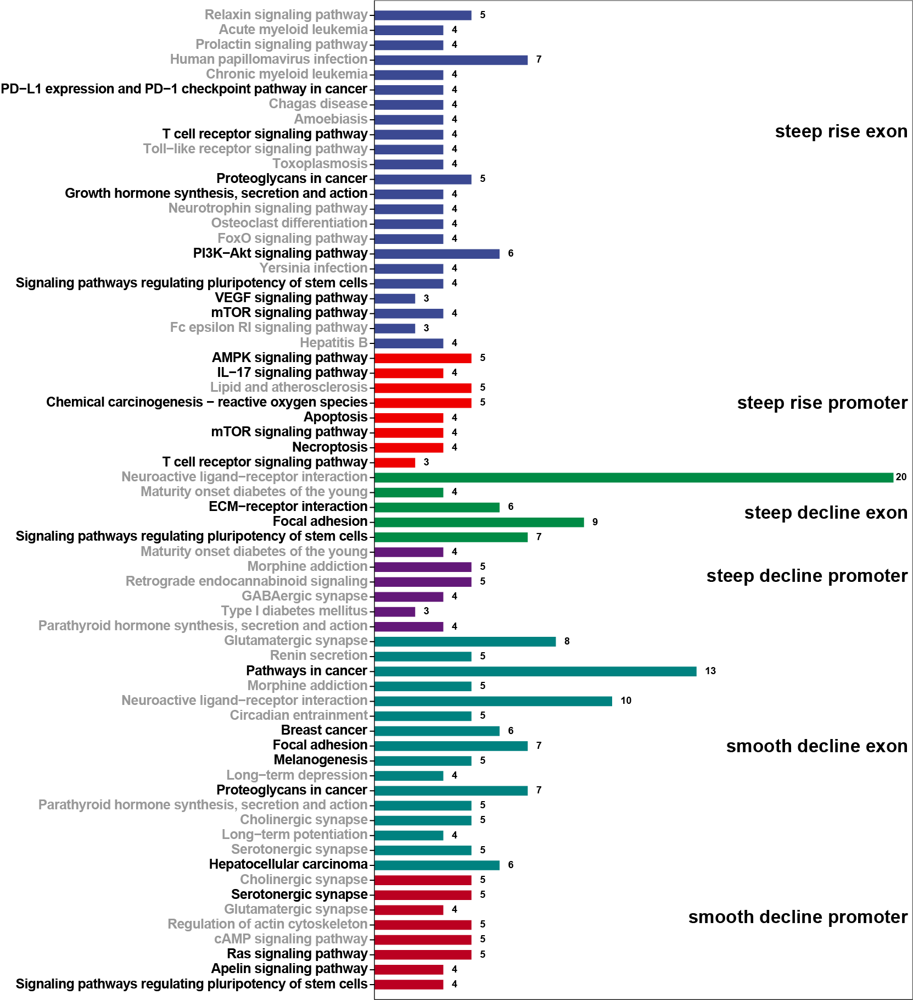
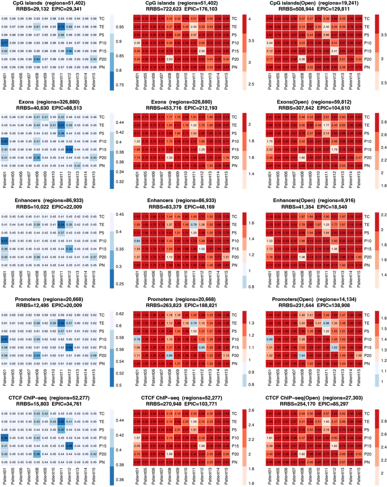
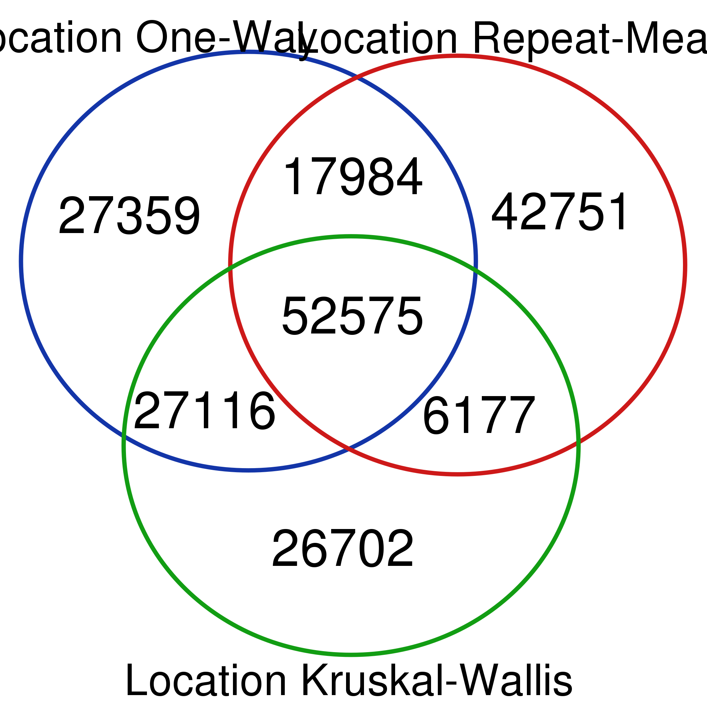
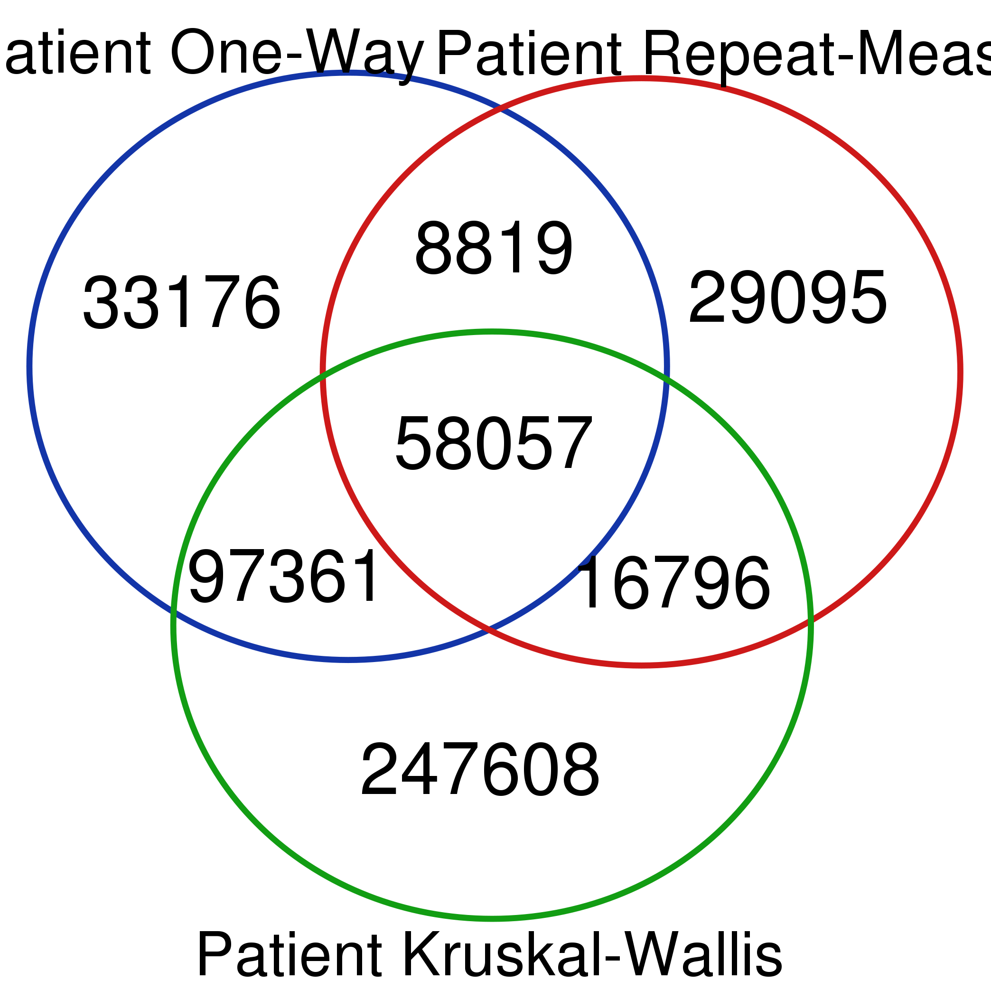

### 文章原定主图

##### Fig.1

##### Fig.2

##### Fig.3

##### Fig.4

##### Fig.5(待完成)

证实肺腺癌肿瘤影响特定基因表达量(qPCR)

### 文章其他附图表

##### Table.1

入组信息

##### Table.2

变化位点及所在/相关基因

##### Fig.S1

补充Fig.1 位点质控

##### Fig.S2

补充Fig.2 Moran特定值域显著性矩阵展示

##### Fig.S3

补充Fig.3 连续变化相关示例

##### Fig.S4

甲基化连续变化位点所在基因聚类

### 其他内容待梳理

##### RRBS与EPIC在各种功能区域检测情况比较

- 左边是RRBS和EPIC测到了的各种region的数量
- 中间是RRBS和EPIC测到的属于各种region的点数
- 右边是RRBS和EPIC测到的属于开放染色区各种region的点数

##### 差异位点检验手段比较

- One-Way ANOVA
- Repeat-Measure ANOVA
- Kruskal-Wallis test

分别以位置(Location)和病人(Patient)为分组依据

##### Chr1中KW显著位点cos距离展示

