# 正常及子痫前期外周血miRNA甲基化修饰测序
# Sequencing of miRNA Methylation Modifications in Peripheral Blood of Normal Pregnancy and Preeclampsia
## 1. 项目概况

本研究主题为基于剖宫产外周血miRNA甲基化组学的子痫前期生物标志物研究。数据集收集的目的是通过分析比较正常孕妇与子痫前期患者血浆中的甲基化miRNA分子谱，鉴定与疾病相关的甲基化miRNA标志物，从而服务于发病机制探索、临床诊断模型构建及后续科研论文发表与行业标准制定，对推动妊娠期疾病的精准诊疗具有重要意义。采集对象为2022年至2024年间，行剖宫产术的孕妇外周血样本，其纳入标准明确分为子痫前期患者组与正常妊娠对照组；采集方式为在剖宫产手术期间前瞻性采集血液样本并进行miRNA甲基化分析。

本报告基于SNIPR-Nm技术分析结果，全面覆盖了本项目所有样本的miRNA测序数据质量，包括碱基质量、序列组成、RNA组分及比对情况。

## 2. 总体测序统计 (General Stats)

以下为所有样本的测序基本情况概览。

| 样本名称           | 测序总量 (Reads) | Q30碱基比例 (%) | 重复率 (%) |
|:---------------|:-------------|:------------|:--------|
| NJU-GLYY-CK-9  | 11.3M        | 95.4%       | 77.2%   |
| NJU-GLYY-CK-10 | 15.9M        | 94.9%       | 66.9%   |
| NJU-GLYY-CK-11 | 23.5M        | 94.2%       | 57.7%   |
| NJU-GLYY-CK-12 | 24.7M        | 95.9%       | 74.6%   |
| NJU-GLYY-CK-13 | 21.9M        | 95.3%       | 56.8%   |
| NJU-GLYY-CK-14 | 21.4M        | 95.0%       | 80.4%   |
| NJU-GLYY-CK-15 | 18.9M        | 95.8%       | 85.3%   |
| NJU-GLYY-CK-16 | 27.5M        | 96.1%       | 82.3%   |
| NJU-GLYY-CK-17 | 21.1M        | 95.0%       | 73.0%   |
| NJU-GLYY-CK-18 | 45.4M        | 95.6%       | 88.8%   |
| NJU-GLYY-CK-19 | 26.3M        | 95.8%       | 81.9%   |
| NJU-GLYY-CK-20 | 38.6M        | 96.4%       | 89.7%   |
| NJU-GLYY-CK-21 | 24.5M        | 96.3%       | 86.6%   |
| NJU-GLYY-CK-22 | 22.3M        | 96.5%       | 81.2%   |
| NJU-GLYY-CK-24 | 21.8M        | 96.4%       | 80.5%   |
| NJU-GLYY-CK-25 | 31.5M        | 96.8%       | 89.2%   |
| NJU-GLYY-CK-26 | 22.6M        | 97.0%       | 83.3%   |
| NJU-GLYY-CK-28 | 38.5M        | 96.4%       | 81.3%   |
| NJU-GLYY-CK-29 | 32.7M        | 95.6%       | 77.7%   |
| NJU-GLYY-CK-30 | 22.2M        | 95.7%       | 65.0%   |
| NJU-GLYY-CK-31 | 28.7M        | 95.2%       | 72.0%   |
| NJU-GLYY-CK-32 | 30.8M        | 89.6%       | 59.8%   |
| NJU-GLYY-CK-33 | 37.0M        | 90.8%       | 72.3%   |
| NJU-GLYY-CK-34 | 29.0M        | 96.7%       | 87.5%   |
| NJU-GLYY-CK-35 | 57.4M        | 96.3%       | 86.6%   |
| NJU-GLYY-CK-36 | 33.9M        | 96.4%       | 77.5%   |
| NJU-GLYY-CK-37 | 61.0M        | 85.6%       | 52.5%   |
| NJU-GLYY-CK-38 | 39.3M        | 87.6%       | 59.6%   |
| NJU-GLYY-CK-39 | 27.5M        | 96.9%       | 77.2%   |
| NJU-GLYY-CK-40 | 34.5M        | 95.8%       | 63.9%   |
| NJU-GLYY-CK-41 | 11.6M        | 96.5%       | 87.0%   |
| NJU-GLYY-CK-42 | 17.8M        | 94.6%       | 31.6%   |
| NJU-GLYY-CK-43 | 36.3M        | 96.7%       | 85.2%   |
| NJU-GLYY-CK-44 | 20.3M        | 95.8%       | 76.1%   |
| NJU-GLYY-CK-45 | 32.2M        | 96.2%       | 40.7%   |
| NJU-GLYY-CK-46 | 17.7M        | 94.1%       | 55.0%   |
| NJU-GLYY-CK-47 | 16.9M        | 93.4%       | 24.0%   |
| NJU-GLYY-CK-48 | 14.9M        | 96.1%       | 69.9%   |
| NJU-GLYY-CK-49 | 29.0M        | 93.9%       | 76.9%   |
| NJU-GLYY-CK-50 | 20.4M        | 93.6%       | 50.5%   |
| NJU-GLYY-CK-51 | 24.9M        | 96.1%       | 77.7%   |
| NJU-GLYY-CK-52 | 33.2M        | 95.7%       | 80.8%   |
| NJU-GLYY-CK-53 | 29.9M        | 96.1%       | 82.7%   |

## 3. FastQC 原始数据质检 (FastQC Raw)

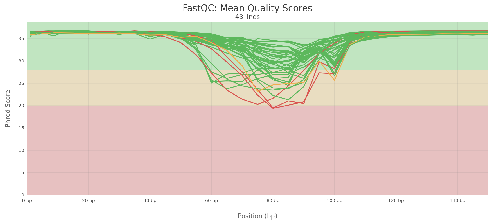

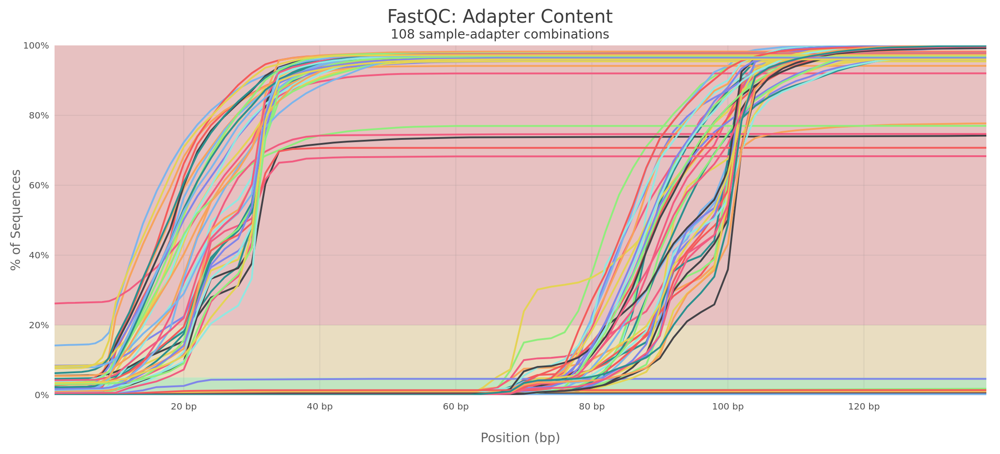

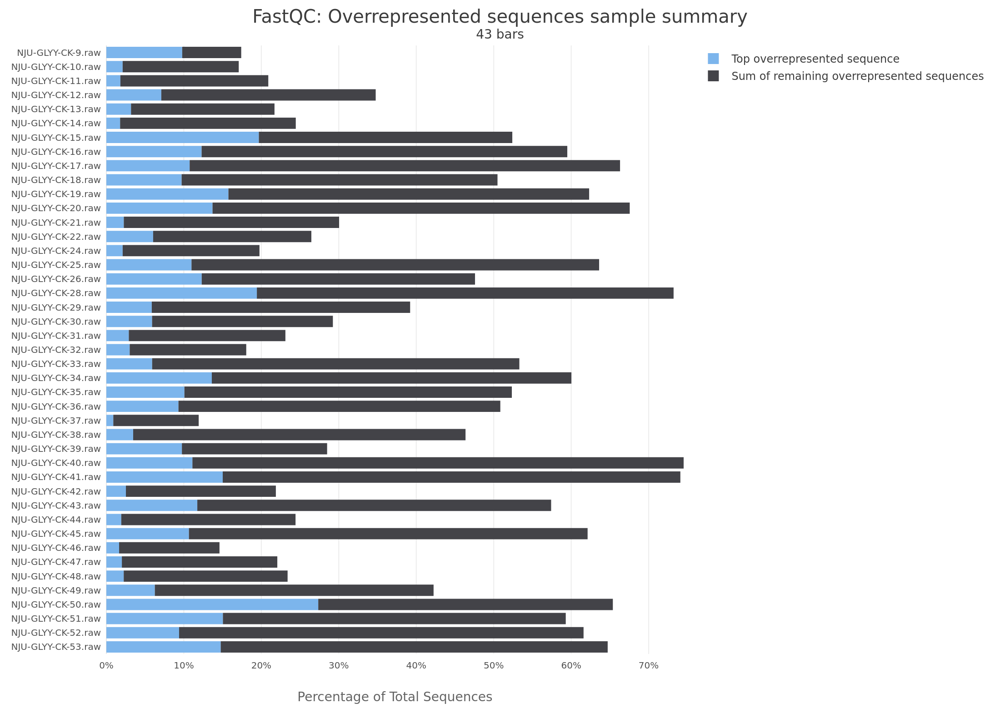

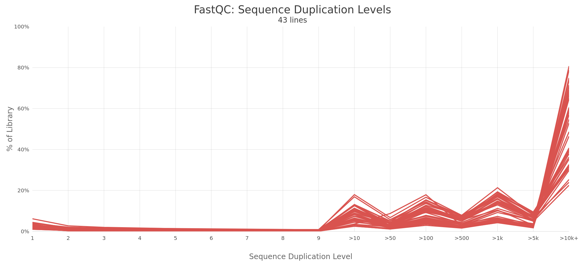

| 样本名称           | 总 reads 数 | 重复率 (%) | GC 含量 (%) | 平均读长 |
|:---------------|:----------|:--------|:----------|:-----|
| NJU-GLYY-CK-9  | 30.3M     | 94.4%   | 71.0%     | 150  |
| NJU-GLYY-CK-10 | 28.9M     | 92.2%   | 70.0%     | 150  |
| NJU-GLYY-CK-11 | 34.7M     | 94.1%   | 68.0%     | 150  |
| NJU-GLYY-CK-12 | 39.7M     | 97.0%   | 68.0%     | 150  |
| NJU-GLYY-CK-13 | 35.3M     | 95.1%   | 69.0%     | 150  |
| NJU-GLYY-CK-14 | 47.5M     | 96.1%   | 69.0%     | 150  |
| NJU-GLYY-CK-15 | 33.5M     | 97.2%   | 69.0%     | 150  |
| NJU-GLYY-CK-16 | 32.3M     | 97.4%   | 67.0%     | 150  |
| NJU-GLYY-CK-17 | 24.7M     | 96.9%   | 67.0%     | 150  |
| NJU-GLYY-CK-18 | 53.4M     | 97.5%   | 63.0%     | 150  |
| NJU-GLYY-CK-19 | 33.2M     | 97.4%   | 68.0%     | 150  |
| NJU-GLYY-CK-20 | 43.9M     | 97.6%   | 67.0%     | 150  |
| NJU-GLYY-CK-21 | 47.0M     | 96.7%   | 70.0%     | 150  |
| NJU-GLYY-CK-22 | 38.9M     | 95.4%   | 70.0%     | 150  |
| NJU-GLYY-CK-24 | 34.9M     | 94.9%   | 69.0%     | 150  |
| NJU-GLYY-CK-25 | 36.7M     | 97.5%   | 67.0%     | 150  |
| NJU-GLYY-CK-26 | 28.8M     | 96.4%   | 68.0%     | 150  |
| NJU-GLYY-CK-28 | 41.2M     | 97.9%   | 67.0%     | 150  |
| NJU-GLYY-CK-29 | 42.7M     | 96.3%   | 68.0%     | 150  |
| NJU-GLYY-CK-30 | 32.6M     | 95.7%   | 69.0%     | 150  |
| NJU-GLYY-CK-31 | 40.4M     | 96.3%   | 68.0%     | 150  |
| NJU-GLYY-CK-32 | 46.1M     | 93.5%   | 68.0%     | 150  |
| NJU-GLYY-CK-33 | 40.3M     | 96.5%   | 67.0%     | 150  |
| NJU-GLYY-CK-34 | 32.7M     | 96.9%   | 67.0%     | 150  |
| NJU-GLYY-CK-35 | 61.6M     | 97.7%   | 67.0%     | 150  |
| NJU-GLYY-CK-36 | 37.3M     | 96.8%   | 67.0%     | 150  |
| NJU-GLYY-CK-37 | 73.8M     | 90.0%   | 65.0%     | 150  |
| NJU-GLYY-CK-38 | 46.1M     | 93.0%   | 66.0%     | 150  |
| NJU-GLYY-CK-39 | 32.4M     | 95.0%   | 67.0%     | 150  |
| NJU-GLYY-CK-40 | 38.0M     | 97.8%   | 67.0%     | 150  |
| NJU-GLYY-CK-41 | 12.1M     | 96.5%   | 66.0%     | 150  |
| NJU-GLYY-CK-42 | 33.9M     | 96.4%   | 71.0%     | 150  |
| NJU-GLYY-CK-43 | 47.3M     | 97.1%   | 69.0%     | 150  |
| NJU-GLYY-CK-44 | 31.6M     | 94.6%   | 69.0%     | 150  |
| NJU-GLYY-CK-45 | 38.8M     | 97.5%   | 67.0%     | 150  |
| NJU-GLYY-CK-46 | 28.5M     | 94.0%   | 69.0%     | 150  |
| NJU-GLYY-CK-47 | 27.6M     | 94.2%   | 70.0%     | 150  |
| NJU-GLYY-CK-48 | 21.4M     | 95.0%   | 68.0%     | 150  |
| NJU-GLYY-CK-49 | 68.0M     | 97.5%   | 71.0%     | 150  |
| NJU-GLYY-CK-50 | 21.9M     | 96.2%   | 68.0%     | 150  |
| NJU-GLYY-CK-51 | 26.7M     | 96.9%   | 66.0%     | 150  |
| NJU-GLYY-CK-52 | 36.6M     | 96.5%   | 66.0%     | 150  |
| NJU-GLYY-CK-53 | 32.9M     | 97.3%   | 67.0%     | 150  |

## 4. FastQC 过滤后数据质检 (FastQC Trimmed)

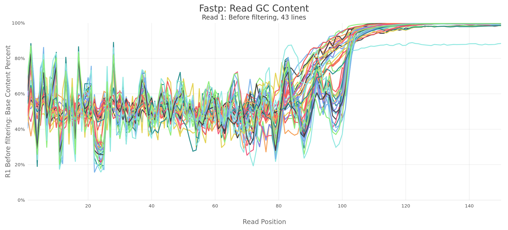

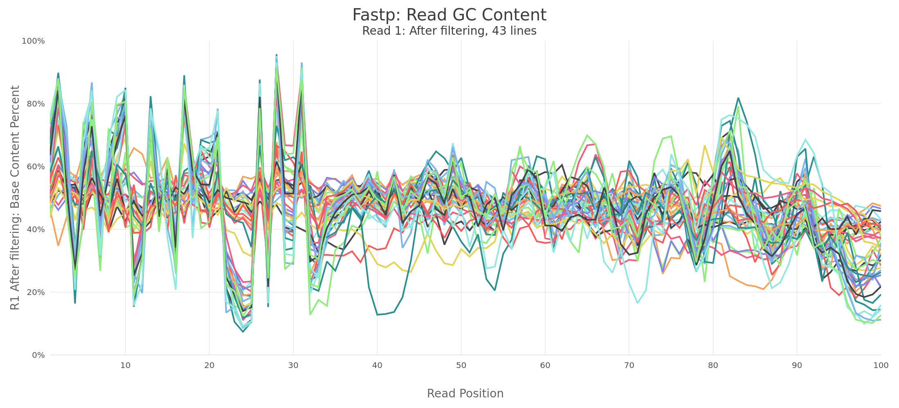

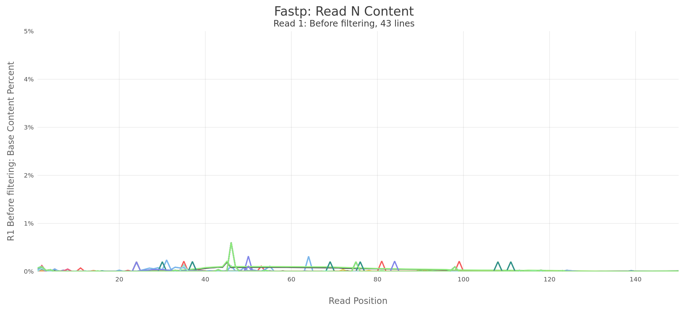

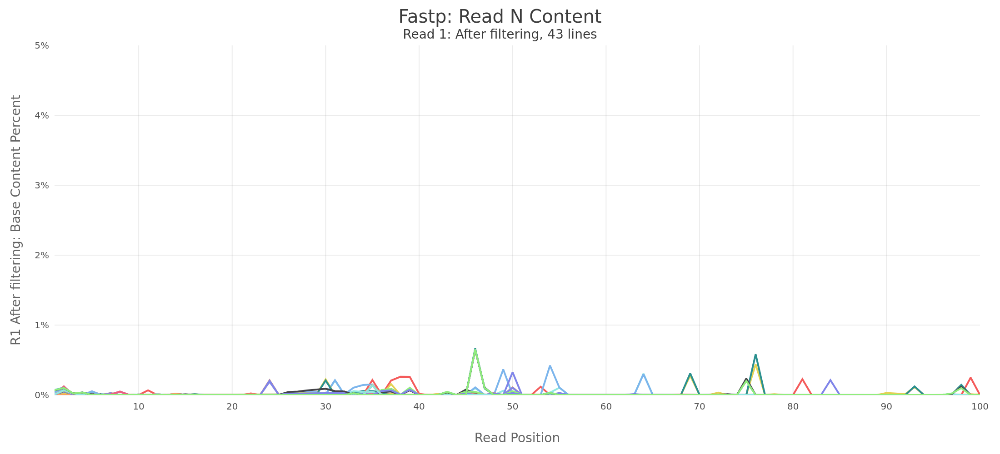

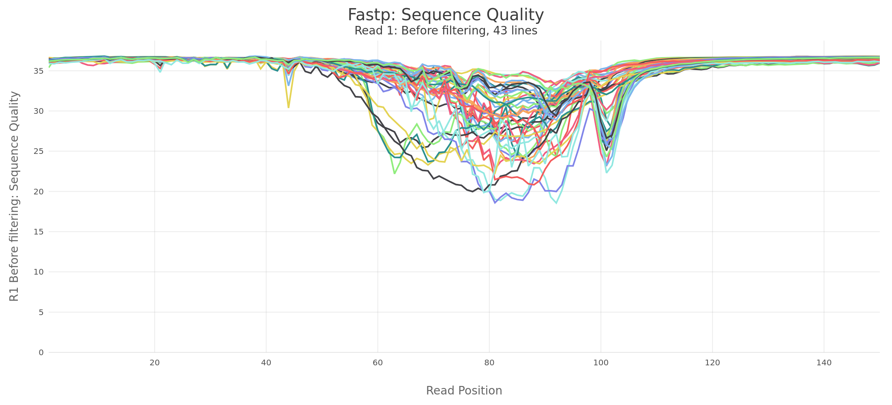

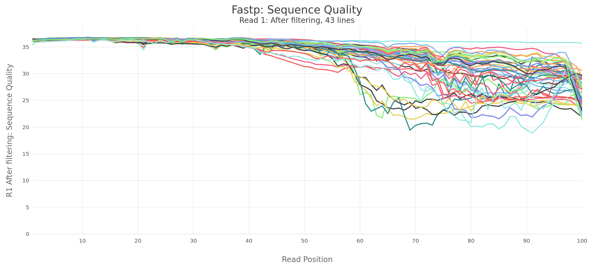

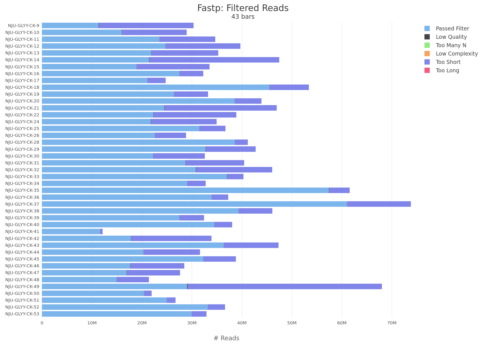

| 样本名称           | 总 reads 数 | 重复率 (%) | GC 含量 (%) | 平均读长 |
|:---------------|:----------|:--------|:----------|:-----|
| NJU-GLYY-CK-9  | 11.3M     | 94.0%   | 51.0%     | 26.1 |
| NJU-GLYY-CK-10 | 15.9M     | 92.8%   | 50.0%     | 27.0 |
| NJU-GLYY-CK-11 | 23.5M     | 95.5%   | 53.0%     | 26.0 |
| NJU-GLYY-CK-12 | 24.7M     | 97.6%   | 54.0%     | 25.6 |
| NJU-GLYY-CK-13 | 21.9M     | 95.8%   | 52.0%     | 26.7 |
| NJU-GLYY-CK-14 | 21.4M     | 95.8%   | 54.0%     | 27.8 |
| NJU-GLYY-CK-15 | 18.9M     | 97.3%   | 53.0%     | 28.2 |
| NJU-GLYY-CK-16 | 27.5M     | 98.2%   | 54.0%     | 29.5 |
| NJU-GLYY-CK-17 | 21.1M     | 97.7%   | 54.0%     | 27.7 |
| NJU-GLYY-CK-18 | 45.4M     | 98.0%   | 50.0%     | 48.3 |
| NJU-GLYY-CK-19 | 26.3M     | 98.1%   | 53.0%     | 30.1 |
| NJU-GLYY-CK-20 | 38.6M     | 98.2%   | 53.0%     | 29.5 |
| NJU-GLYY-CK-21 | 24.5M     | 97.1%   | 49.0%     | 24.1 |
| NJU-GLYY-CK-22 | 22.3M     | 95.9%   | 52.0%     | 25.1 |
| NJU-GLYY-CK-24 | 21.8M     | 95.3%   | 50.0%     | 28.5 |
| NJU-GLYY-CK-25 | 31.5M     | 98.2%   | 52.0%     | 29.8 |
| NJU-GLYY-CK-26 | 22.6M     | 97.3%   | 52.0%     | 28.7 |
| NJU-GLYY-CK-28 | 38.5M     | 98.5%   | 53.0%     | 29.2 |
| NJU-GLYY-CK-29 | 32.7M     | 97.4%   | 49.0%     | 27.7 |
| NJU-GLYY-CK-30 | 22.2M     | 96.7%   | 52.0%     | 28.1 |
| NJU-GLYY-CK-31 | 28.7M     | 97.3%   | 49.0%     | 27.5 |
| NJU-GLYY-CK-32 | 30.8M     | 96.3%   | 46.0%     | 31.9 |
| NJU-GLYY-CK-33 | 37.0M     | 98.2%   | 50.0%     | 30.2 |
| NJU-GLYY-CK-34 | 29.0M     | 97.8%   | 53.0%     | 28.6 |
| NJU-GLYY-CK-35 | 57.4M     | 98.5%   | 53.0%     | 29.9 |
| NJU-GLYY-CK-36 | 33.9M     | 97.8%   | 53.0%     | 29.6 |
| NJU-GLYY-CK-37 | 61.0M     | 95.6%   | 45.0%     | 34.4 |
| NJU-GLYY-CK-38 | 39.3M     | 97.4%   | 51.0%     | 34.7 |
| NJU-GLYY-CK-39 | 27.5M     | 96.5%   | 49.0%     | 28.3 |
| NJU-GLYY-CK-40 | 34.5M     | 98.4%   | 53.0%     | 27.4 |
| NJU-GLYY-CK-41 | 11.6M     | 97.3%   | 52.0%     | 29.5 |
| NJU-GLYY-CK-42 | 17.8M     | 96.8%   | 51.0%     | 25.0 |
| NJU-GLYY-CK-43 | 36.3M     | 98.1%   | 52.0%     | 28.7 |
| NJU-GLYY-CK-44 | 20.3M     | 95.9%   | 48.0%     | 25.4 |
| NJU-GLYY-CK-45 | 32.2M     | 98.3%   | 53.0%     | 28.2 |
| NJU-GLYY-CK-46 | 17.7M     | 95.5%   | 48.0%     | 26.3 |
| NJU-GLYY-CK-47 | 16.9M     | 95.0%   | 48.0%     | 27.2 |
| NJU-GLYY-CK-48 | 14.9M     | 96.4%   | 52.0%     | 28.2 |
| NJU-GLYY-CK-49 | 29.0M     | 97.5%   | 48.0%     | 25.3 |
| NJU-GLYY-CK-50 | 20.4M     | 97.3%   | 52.0%     | 30.5 |
| NJU-GLYY-CK-51 | 24.9M     | 97.8%   | 53.0%     | 29.8 |
| NJU-GLYY-CK-52 | 33.2M     | 97.5%   | 52.0%     | 29.0 |
| NJU-GLYY-CK-53 | 29.9M     | 98.2%   | 52.0%     | 30.0 |

## 5. 小RNA组分分析 (MirTrace Data)

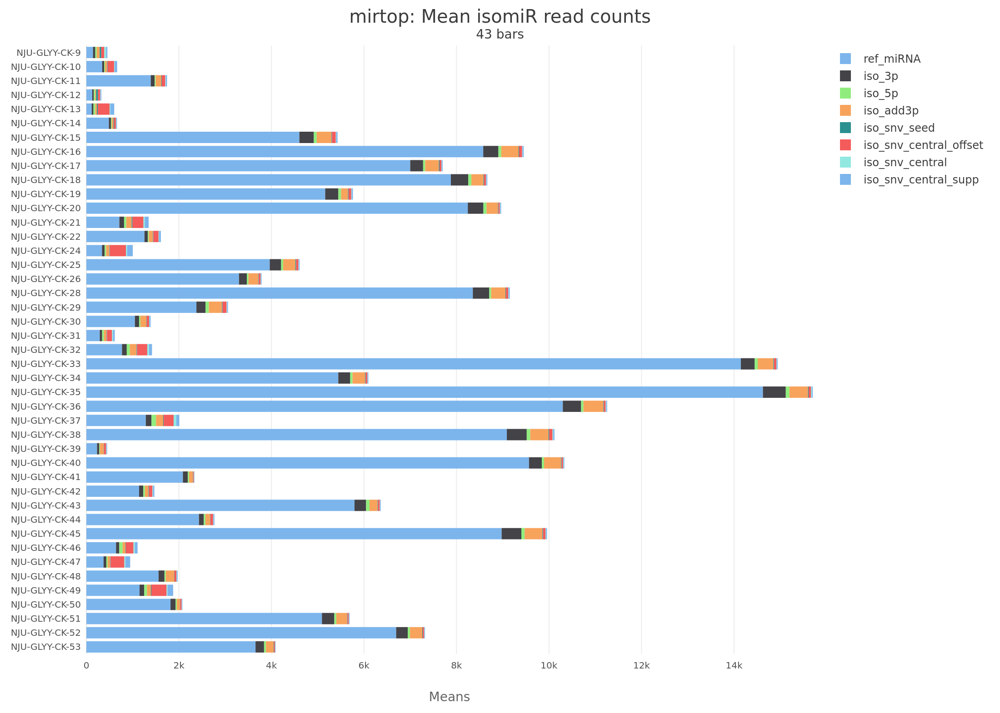

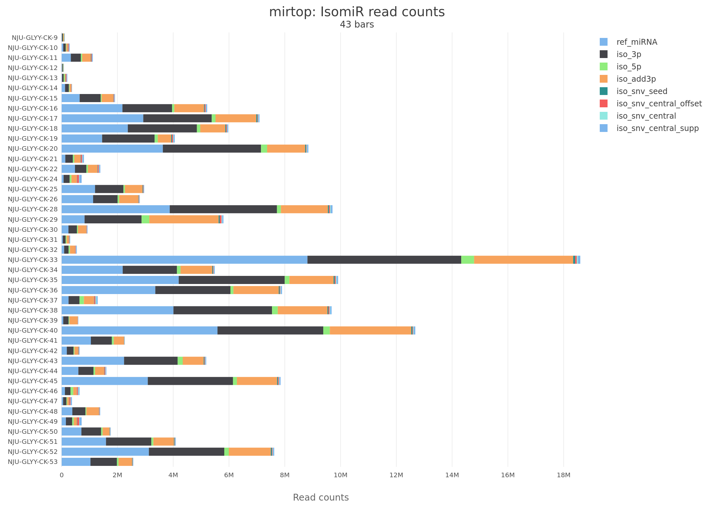

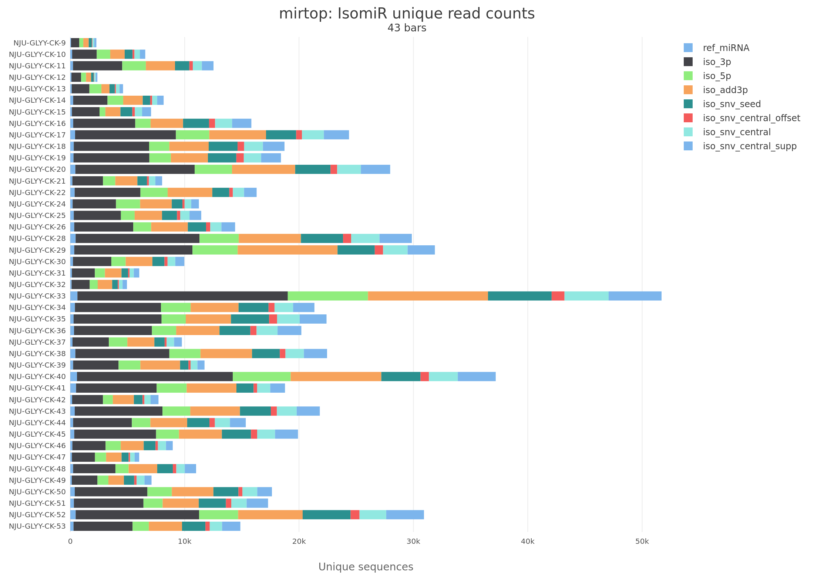

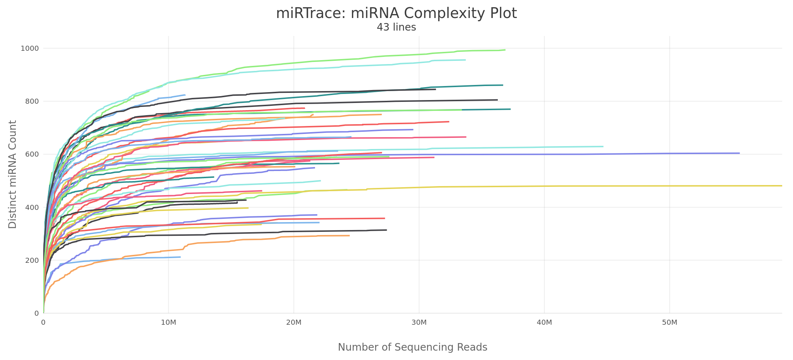

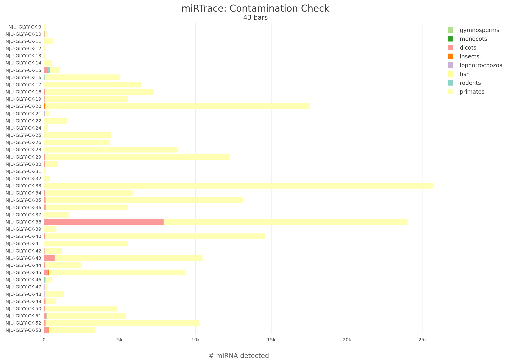

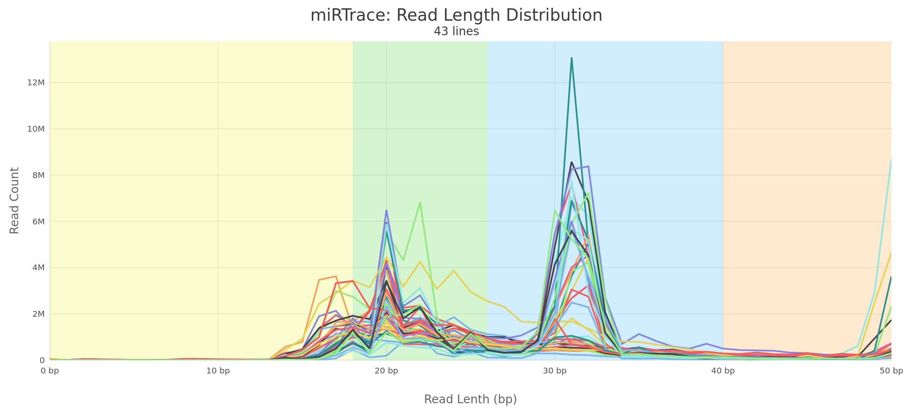

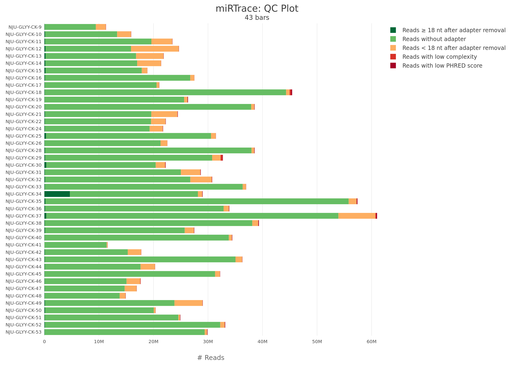

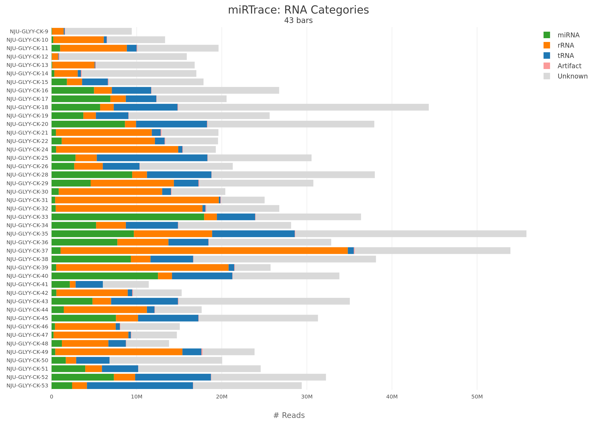

| 样本名称           | miRNA (reads) | rRNA (reads) | tRNA (reads) | 未知序列 (reads) |
|:---------------|:--------------|:-------------|:-------------|:-------------|
| NJU-GLYY-CK-9  | 57,423        | 1,368,563    | 123,904      | 7,808,834    |
| NJU-GLYY-CK-10 | 193,438       | 5,945,084    | 342,343      | 6,792,766    |
| NJU-GLYY-CK-11 | 1,006,347     | 7,838,640    | 1,154,444    | 9,539,307    |
| NJU-GLYY-CK-12 | 39,239        | 737,042      | 69,213       | 14,946,150   |
| NJU-GLYY-CK-13 | 79,420        | 4,980,555    | 80,571       | 11,608,456   |
| NJU-GLYY-CK-14 | 322,776       | 2,750,770    | 371,027      | 13,459,130   |
| NJU-GLYY-CK-15 | 1,805,234     | 1,780,501    | 3,036,691    | 11,152,932   |
| NJU-GLYY-CK-16 | 4,991,245     | 2,093,209    | 4,620,287    | 14,991,044   |
| NJU-GLYY-CK-17 | 6,913,179     | 1,811,079    | 3,585,433    | 8,221,754    |
| NJU-GLYY-CK-18 | 5,705,119     | 1,603,447    | 7,499,874    | 29,448,361   |
| NJU-GLYY-CK-19 | 3,739,469     | 1,469,591    | 3,819,437    | 16,548,469   |
| NJU-GLYY-CK-20 | 8,626,981     | 1,299,614    | 8,339,601    | 19,600,105   |
| NJU-GLYY-CK-21 | 513,503       | 11,268,769   | 1,035,292    | 6,678,237    |
| NJU-GLYY-CK-22 | 1,195,313     | 10,949,954   | 1,143,145    | 6,188,860    |
| NJU-GLYY-CK-24 | 537,253       | 14,347,022   | 486,789      | 3,867,649    |
| NJU-GLYY-CK-25 | 2,819,654     | 2,493,017    | 13,006,621   | 12,193,100   |
| NJU-GLYY-CK-26 | 2,666,902     | 3,352,030    | 4,317,805    | 10,920,710   |
| NJU-GLYY-CK-28 | 9,474,586     | 1,737,238    | 7,574,729    | 19,163,967   |
| NJU-GLYY-CK-29 | 4,594,309     | 9,779,721    | 2,890,180    | 13,398,375   |
| NJU-GLYY-CK-30 | 847,593       | 12,150,964   | 1,032,621    | 6,308,195    |
| NJU-GLYY-CK-31 | 424,070       | 19,229,878   | 188,095      | 5,119,919    |
| NJU-GLYY-CK-32 | 491,405       | 17,242,101   | 341,918      | 8,585,306    |
| NJU-GLYY-CK-33 | 17,932,325    | 1,492,069    | 4,503,590    | 12,387,312   |
| NJU-GLYY-CK-34 | 5,238,119     | 3,492,047    | 6,122,643    | 13,251,346   |
| NJU-GLYY-CK-35 | 9,673,175     | 9,195,362    | 9,711,559    | 27,158,596   |
| NJU-GLYY-CK-36 | 7,733,950     | 5,999,726    | 4,694,855    | 14,385,938   |
| NJU-GLYY-CK-37 | 1,056,970     | 33,751,309   | 706,934      | 18,307,079   |
| NJU-GLYY-CK-38 | 9,310,287     | 2,315,382    | 5,011,683    | 21,441,062   |
| NJU-GLYY-CK-39 | 540,467       | 20,260,738   | 659,736      | 4,209,328    |
| NJU-GLYY-CK-40 | 12,507,369    | 1,645,961    | 7,097,827    | 12,530,292   |
| NJU-GLYY-CK-41 | 2,147,273     | 678,383      | 3,201,560    | 5,386,539    |
| NJU-GLYY-CK-42 | 565,253       | 8,385,501    | 527,788      | 5,721,446    |
| NJU-GLYY-CK-43 | 4,808,687     | 2,190,952    | 7,853,561    | 20,130,437   |
| NJU-GLYY-CK-44 | 1,435,107     | 9,769,550    | 896,755      | 5,480,148    |
| NJU-GLYY-CK-45 | 7,568,605     | 2,596,953    | 7,084,174    | 14,007,214   |
| NJU-GLYY-CK-46 | 405,764       | 7,130,787    | 492,817      | 6,984,764    |
| NJU-GLYY-CK-47 | 237,383       | 8,794,553    | 293,852      | 5,339,513    |
| NJU-GLYY-CK-48 | 1,212,766     | 5,464,775    | 2,053,613    | 5,032,720    |
| NJU-GLYY-CK-49 | 436,064       | 14,940,341   | 2,224,123    | 6,109,314    |
| NJU-GLYY-CK-50 | 1,675,134     | 1,219,841    | 3,921,343    | 13,220,170   |
| NJU-GLYY-CK-51 | 3,959,946     | 1,960,634    | 4,255,996    | 14,375,268   |
| NJU-GLYY-CK-52 | 7,325,162     | 2,497,861    | 8,910,345    | 13,468,868   |
| NJU-GLYY-CK-53 | 2,421,540     | 1,733,900    | 12,461,662   | 12,740,736   |

## 6. Samtools 比对统计 (Alignment Stats)

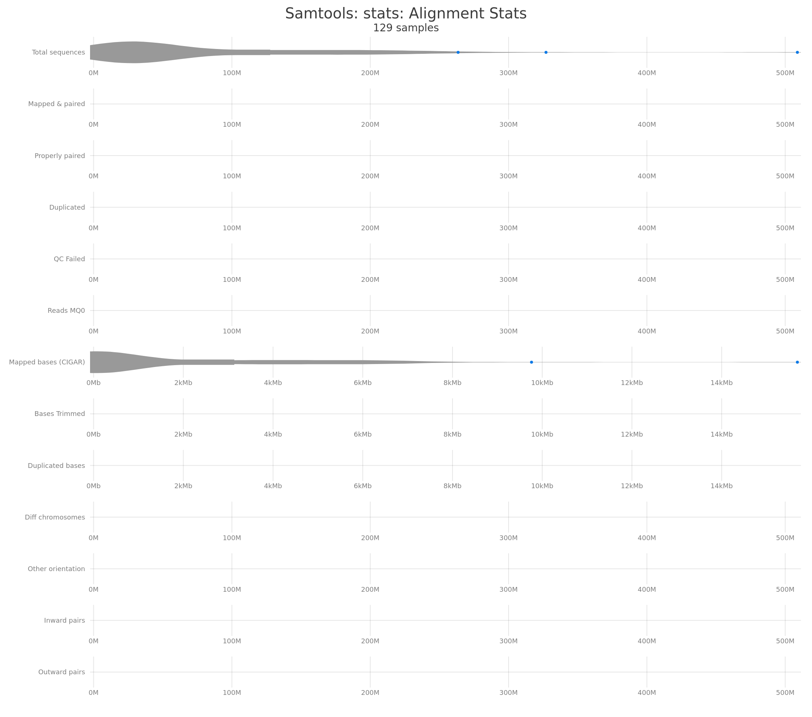

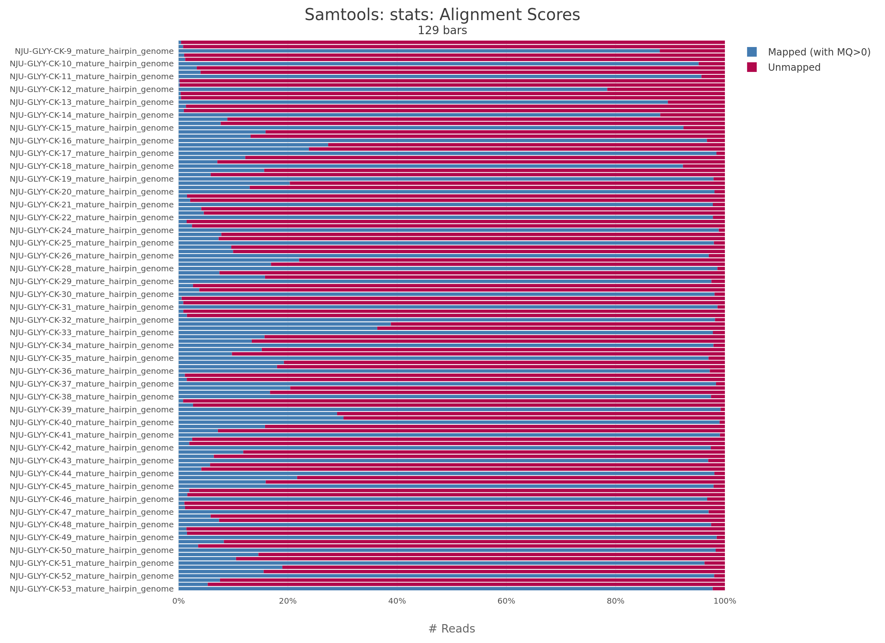

| 样本名称           | 比对率 (%) | 插入片段平均长度 | 错误率 (%) |
|:---------------|:--------|:---------|:--------|
| NJU-GLYY-CK-9  | 88.1%   | 48.5     | 3.07%   |
| NJU-GLYY-CK-10 | 95.2%   | 104.7    | 1.85%   |
| NJU-GLYY-CK-11 | 95.7%   | 156.1    | 0.94%   |
| NJU-GLYY-CK-12 | 78.5%   | 70.0     | 2.85%   |
| NJU-GLYY-CK-13 | 89.6%   | 101.0    | 3.96%   |
| NJU-GLYY-CK-14 | 88.2%   | 90.7     | 0.81%   |
| NJU-GLYY-CK-15 | 92.4%   | 92.3     | 0.29%   |
| NJU-GLYY-CK-16 | 96.7%   | 140.1    | 0.22%   |
| NJU-GLYY-CK-17 | 98.4%   | 100.3    | 0.38%   |
| NJU-GLYY-CK-18 | 92.3%   | 205.4    | 0.20%   |
| NJU-GLYY-CK-19 | 97.9%   | 139.9    | 0.29%   |
| NJU-GLYY-CK-20 | 98.1%   | 207.2    | 0.39%   |
| NJU-GLYY-CK-21 | 97.8%   | 208.4    | 2.01%   |
| NJU-GLYY-CK-22 | 97.8%   | 170.4    | 0.78%   |
| NJU-GLYY-CK-24 | 98.9%   | 195.4    | 3.06%   |
| NJU-GLYY-CK-25 | 98.0%   | 236.0    | 0.20%   |
| NJU-GLYY-CK-26 | 97.0%   | 131.8    | 0.25%   |
| NJU-GLYY-CK-28 | 98.6%   | 205.7    | 0.20%   |
| NJU-GLYY-CK-29 | 97.5%   | 210.7    | 1.08%   |
| NJU-GLYY-CK-30 | 98.1%   | 187.9    | 0.79%   |
| NJU-GLYY-CK-31 | 98.6%   | 251.4    | 2.54%   |
| NJU-GLYY-CK-32 | 98.2%   | 257.4    | 1.92%   |
| NJU-GLYY-CK-33 | 97.8%   | 133.2    | 0.23%   |
| NJU-GLYY-CK-34 | 97.9%   | 179.9    | 0.20%   |
| NJU-GLYY-CK-35 | 97.0%   | 327.1    | 0.20%   |
| NJU-GLYY-CK-36 | 97.2%   | 183.2    | 0.19%   |
| NJU-GLYY-CK-37 | 98.4%   | 508.8    | 1.57%   |
| NJU-GLYY-CK-38 | 97.5%   | 190.9    | 0.23%   |
| NJU-GLYY-CK-39 | 99.2%   | 249.2    | 1.71%   |
| NJU-GLYY-CK-40 | 99.0%   | 167.3    | 0.43%   |
| NJU-GLYY-CK-41 | 99.1%   | 73.1     | 0.24%   |
| NJU-GLYY-CK-42 | 97.4%   | 140.2    | 1.11%   |
| NJU-GLYY-CK-43 | 96.9%   | 206.7    | 0.23%   |
| NJU-GLYY-CK-44 | 98.1%   | 158.6    | 0.56%   |
| NJU-GLYY-CK-45 | 97.9%   | 181.3    | 0.26%   |
| NJU-GLYY-CK-46 | 96.8%   | 127.5    | 1.84%   |
| NJU-GLYY-CK-47 | 97.0%   | 128.1    | 2.55%   |
| NJU-GLYY-CK-48 | 97.5%   | 110.5    | 0.60%   |
| NJU-GLYY-CK-49 | 98.5%   | 263.5    | 2.09%   |
| NJU-GLYY-CK-50 | 98.3%   | 124.4    | 0.27%   |
| NJU-GLYY-CK-51 | 96.3%   | 129.4    | 0.21%   |
| NJU-GLYY-CK-52 | 98.0%   | 200.9    | 0.22%   |
| NJU-GLYY-CK-53 | 97.8%   | 230.3    | 0.22%   |

## 7. 结论与建议

本次测序覆盖了所有提交的样本，各样本的数据质量（Q30）普遍较高。miRNA组分组成在样本间表现出显著差异。